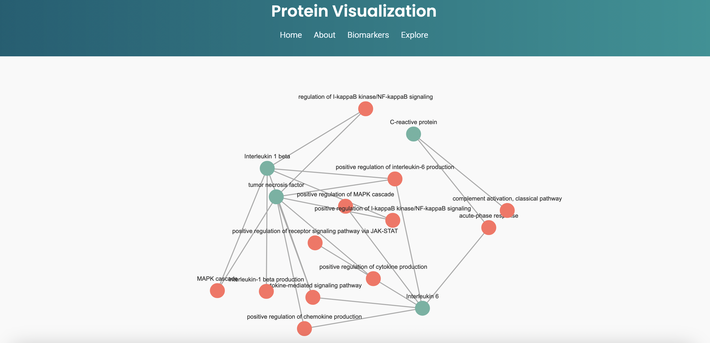

# Group-4-Final-Product

## Project Overview

This repository contains resources for a web-based project related to biomarkers and inflammatory pathways. The primary focus is on visualizing key signaling pathways involved in inflammation, such as CRP (C-reactive protein), IL-1, IL-6, and TNF. These visualizations help in understanding the role of these biomarkers in various physiological and disease processes.

This project was developed during the **Practical Programming in the Life Sciences (2425-PRA3006)** course at **Maastricht University**, in the **Maastricht Science Programme** bachelor's degree.

The objective of the course is to learn how to interact with SPARQL endpoints using JavaScript and visualize the results graphically with libraries like **D3.js** or **Cytoscape.js**. The project is built with a simple HTML, CSS, and JavaScript-based structure. It includes an informative website that presents these pathways alongside their respective images. The website is styled with custom CSS to ensure an engaging and clean user experience.

---

## Features

- **Dynamic Data Visualization**: Interactive visualizations of relationships between proteins and biological processes using D3.js.
- **Biomarker Pathways**: Visual representations of inflammatory pathways like CRP, IL-1, IL-6, and TNF.
- **Responsive Website**: Basic HTML and CSS layout for presenting the pathways and relevant content.
- **Images**: High-quality pathway diagrams to visualize the biological processes.

---

## Technology Choices

### Why D3.js?
D3.js was chosen for this project due to its powerful capabilities for creating dynamic, data-driven visualizations. It supports:
- Customizable layouts, such as force-directed graphs, to represent biological relationships.
- Scalability for handling data of varying sizes and complexities.
- Seamless integration with HTML and CSS for visually appealing designs.

### Why SPARQL?
SPARQL was used to query interconnected biological data from Wikidata, as it provides:
- A robust query language for datasets in RDF format.
- The ability to dynamically query proteins, biological processes, and related Gene Ontology (GO) terms.
---

## Project Structure

- **HTML**: Contains the website layout and interactive components.
- **CSS**: Custom styling to ensure a clean and responsive design.
- **JavaScript**: Handles data fetching from the SPARQL endpoint and visualizes the results using D3.js.

---

## Getting Started

To get a local copy of this project up and running, follow these steps:

1. **Clone the repository**:
   ```bash
   git clone https://github.com/yourusername/Group-4-Final-Product.git

2. **Navigate to the website directory**:
   ```bash
   cd Group-4-Final-Product/website
   ```

3. **Set up d3.js**:  
The project uses the d3.js library for data visualization. You can include it in two ways:

- **Option 1: Use a CDN (recommended)**  
  Add the following `<script>` tag to the `<head>` section of your HTML file:  
  ```html
  <script src="https://d3js.org/d3.v6.min.js"></script>
  
- **Option 2: Download d3.js locally**  
  1. Download the library from [d3js.org](https://d3js.org/).
  2. Save it in a `js` directory within your project structure (e.g., `Group-4-Final-Product/website/js/`).
  3. Add the following `<script>` tag to the `<head>` section of your HTML file:  
     ```html
     <script src="js/d3.v6.min.js"></script>
     ```

4. **Open the `homepage.html` file in your preferred web browser to view the project.**

5. ### Expected Visualizations

Below are example screenshots showcasing the behaviour of the visualizations in this project:

#### Example 1: Visualization of Protein-Biological Process Relationships



*Contributions are welcome! If you'd like to improve the website or add new pathway visualizations, feel free to fork the repository and submit a pull request.*


